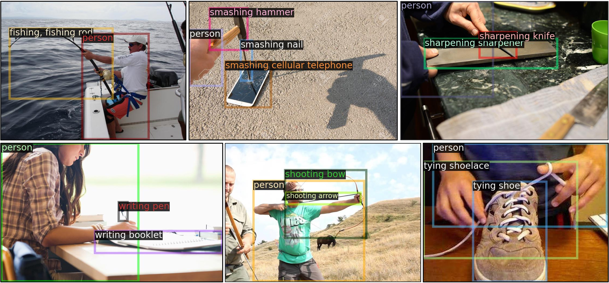

# large_vocabulary_hoi_detection
Code for ICCV2021: Discovering Human Interactions with Large-Vocabulary Objects via Query and Multi-Scale Detection


## Assembled Datasets
### SWiG-HOI 
Note: The assembled SWiG-HOI is based on the [SWiG](https://github.com/allenai/swig) dataset. Please refer to this [repo](https://github.com/allenai/swig) to download the dataset. The processed annotations can be downloaded from [here](https://drive.google.com/drive/folders/1moeVor6WAc_ztTsnTFHPyElJOCLWUOgu?usp=sharing).



Find more information in this page [assembled_datasets.md](./data/assembled_datasets.md).


## Getting Started
### Installation
This code is built on [Detectron2](https://github.com/facebookresearch/detectron2). 
Note that you don't need to build detectron2 seperately as this codebase is self-contained. You can follow the instructions
below to install the dependencies and build this repo. 
```bash
conda create -n choir python=3.8
# Install Pytorch >= 1.7
conda install pytorch==1.7.0 torchvision==0.8.0 cudatoolkit=10.2 -c pytorch
# Timm (https://github.com/rwightman/pytorch-image-models)
pip install timm
conda install scipy matplotlib
# fvcore
pip install 'git+https://github.com/facebookresearch/fvcore'
# install LVIS API, for large vocabulary object detection evaluation
pip install lvis
# Build this repo
python setup.py build develop
```

### Inference Demo with Pre-trained Models

Pick a model and its config file from [model zoo](https://github.com/scwangdyd/large_vocabulary_hoi_detection/blob/master/models/model_zoo.md), for example, using `configs/swig_hoi/hoir_swin.yaml` and this [model](https://drive.google.com/file/d/1-MG9Ef7uXgmVWwM_OppXap1ecvWgowcy/view?usp=sharing). Run it with:
```
python tools/demo.py --config-file configs/swig_hoi/hoir_swin.yaml \
  --input figures/example*.jpg \
  --confidence-threshold 0.2 \
  --opts MODEL.WEIGHTS path-to-model-weights
```

### Training & Evaluation in Command Line

To train a model, run
```
python tools/train_net.py --num-gpus 8 \
    --config-file configs/swig_hoi/hoir_swin.yaml
```

To evaluate the trained models, run
```
python tools/test_net.py --num-gpus 1 \
    --config-file configs/swig_hoi/hoir_swin.yaml \
    --eval-only
```

## Citing
If you find this repository useful, please consider giving a citation
```
@InProceedings{Wang_2021_ICCV,
    author    = {Wang, Suchen and Yap, Kim-Hui and Ding, Henghui and Wu, Jiyan and Yuan, Junsong and Tan, Yap-Peng},
    title     = {Discovering Human Interactions With Large-Vocabulary Objects via Query and Multi-Scale Detection},
    booktitle = {Proceedings of the IEEE/CVF International Conference on Computer Vision (ICCV)},
    year      = {2021},
}
```
If you find the [SWiG](https://github.com/allenai/swig) and [100DOH](https://fouheylab.eecs.umich.edu/~dandans/projects/100DOH/) datasets are useful, please also cite their papers
```
@article{Pratt2020Swig,
title={Grounded Situation Recognition},
author={Sarah Pratt and Mark Yatskar and Luca Weihs and Ali Farhadi and Aniruddha Kembhavi},
journal={ArXiv},
year={2020},
volume={abs/2003.12058}
}
```
```
@INPROCEEDINGS{Shan20, 
    author = {Shan, Dandan and Geng, Jiaqi and Shu, Michelle  and Fouhey, David},
    title = {Understanding Human Hands in Contact at Internet Scale},
    booktitle = {CVPR}, 
    year = {2020} 
}
```

TODO
- [ ] Assembled DOH-HOI dataset
- [ ] More pretrained models in Model Zoo